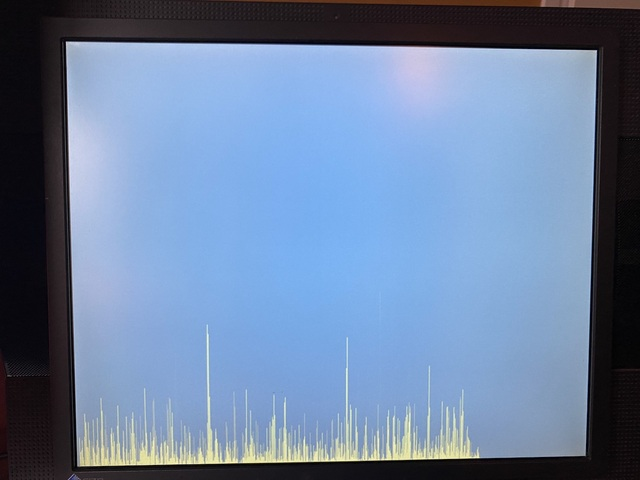

## FPGA spectrum analyser

This was a final project in a VHDL course ar [AGSTU](https://yh.agstu.se/).
From the documentation:

> Fast Fourier transform is ubiquitous in digital signal processing, in this
  project an analogue audio signal from a I2S connected AD-converter is processed
  using techniques such as
  windowing, overlapping frames, then a FFT is taken, frequency power is
  calculated and represented on a VGA monitor. The design includes several custom
  components and third party IP cores, the design is validated and verified on an FPGA.

The design has been run on a intel MAX10 FPGA. For an FFT
[dblclockfft](https://github.com/ZipCPU/dblclockfft) is used.

